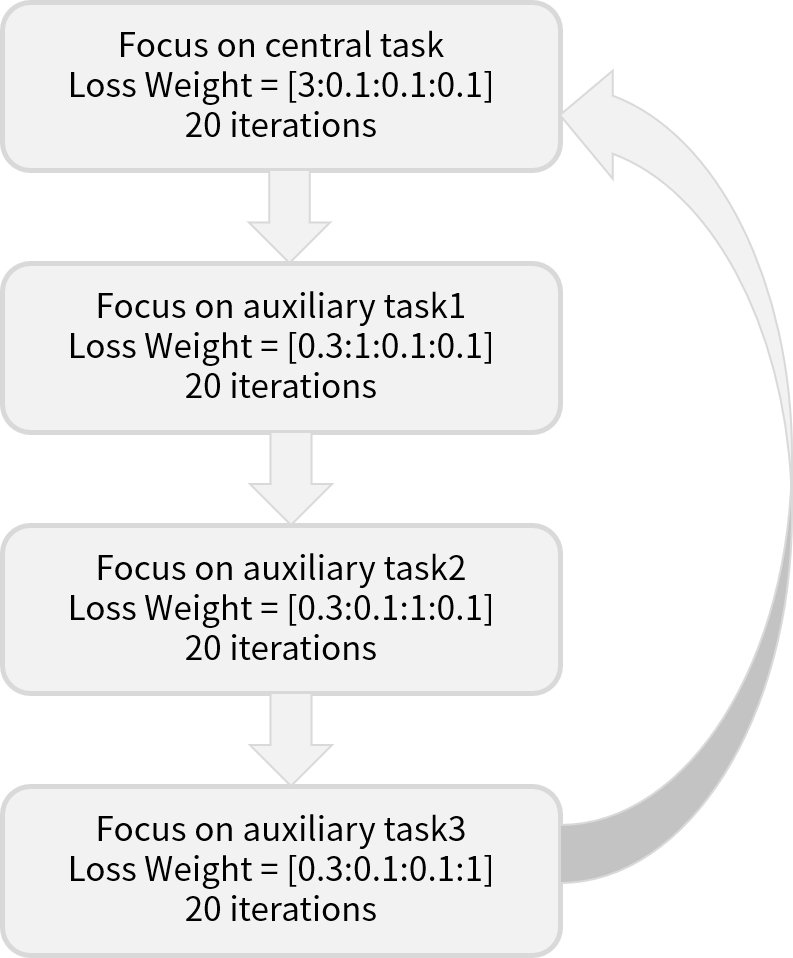

# BRET: Biomedical Relation Extraction Tool
-

: We apply weighting method to MT-DNN model to improve the performance of relation extraction task.
Auxillary tasks such as NER, QA, Multi-label Classification, were used to train our model with main task: RE.

### Relation Extraction model architecture  

#### Our method 
https://github.com/namisan/mt-dnn

We extend MT-DNN([https://github.com/namisan/mt-dnn](https://github.com/namisan/mt-dnn)) for biomedical text mining tasks. So, we employ BioBERT model pre-trained on biomedical domain texts in addition to English Wikipedia, BooksCorpus. 

And we use multiple biomedical domain datasets for multi-task learning. However, it was reported that multi-task learning can be confused because model calculates the final loss by just summing the losses of each tasks. 

To address this problem, we applied Periodic Focusing Learning Policy(PFLP) and Internal-transfer Weighting(ITW) proposed by [https://arxiv.org/abs/1912.07167](https://arxiv.org/abs/1912.07167). By this method, the model can concentrate on all tasks sequentially. However, at the end of the training, the model focuses on the central task.

 

Randomly selected data passes through shared layer first. Then it passes through the task specific layer where the loss is calculated according to the loss function for each task.

#### Task and Dataset

Task 1. Relation Extraction

  - Dataset: Chemprot, DDI, GAD

Task 2. Named Entitiy Recognition

  - Dataset: BC5CDR-disease

Task 3. Question Answering

  - Dataset: BioASQ
  

Task 4. Multi-label Classification

  - Dataset: HOC

  

